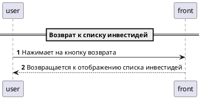

# Страница деталей инвестидеи

## Описание 

Страница должна:
- отображть детали [инвестидеи](../domain/invest_idea.md):
    - факторы роста
    - рекомендуемые цены
    - фильтровать список по заданным параметрам
- предоставлять возможность возврата к списку инвестидей

## Схема работы

## Описание интерфейса

- Страница
    - Панель управления
        - Кнопка возврата
    - Метка: Наименование ценной бумаги($.security.name)
    - Список
        - Элемент списка
            - Метка: Фактор роста ($.growthFactors[*].description)
    - Блок 
        - Метка: Дата покупки ($.buyDate)
        - Метка: Цена покупки (текстовая константа)
        - Метка: Значение цены покупки ($.buyRate)
    - Блок 
        - Метка: Дата продажи ($.sellDate)
        - Метка: Цена продажи (текстовая константа)
        - Метка: Значение цены продажи ($.sellRate)

*Здесь ссылка на дизайн или скрин страницы*

## Ограничения

- доступ к странице должны иметь только пользователи с [правом просмотра инвестидей](../rights/invest_idea_view.md)