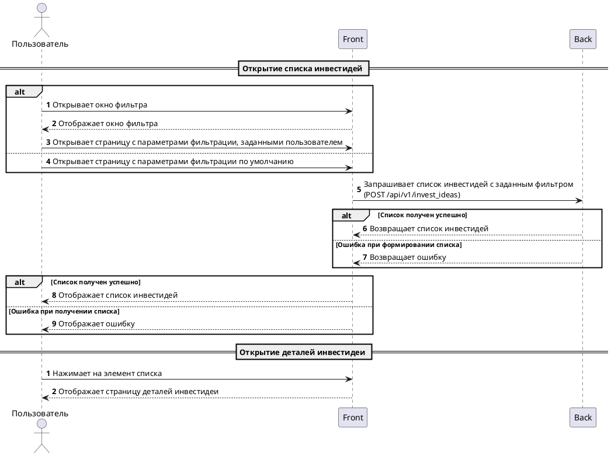

# Страница списка инвестидей

## Описание 

Страница должна: 
- отображть список [инвестидей](../domain/invest_idea.md)
- открывать детали инвестидеи по нажатию на элемент списка
- предоставлять возможность вызова окна параметров фильтрации
- фильтровать список по заданным параметрам

## Схема работы

## Описание интерфейса

- Страница
    - Панель управления
        - Текст текущего фильтра: текст
        - Кнопка открытия диалога фильтра: кнопка с рисунком
    - Список
        - Элемент списка
            - Наименование инвестидеии: текст ($.name)

*Здесь ссылка на дизайн или скрин страницы*

## Ограничения

- доступ к странице должны иметь только пользователи с [правом просмотра инвестидей](../rights/invest_idea_view.md)
- в списке не должны отображаться инвестидеи с вышедшим сроком