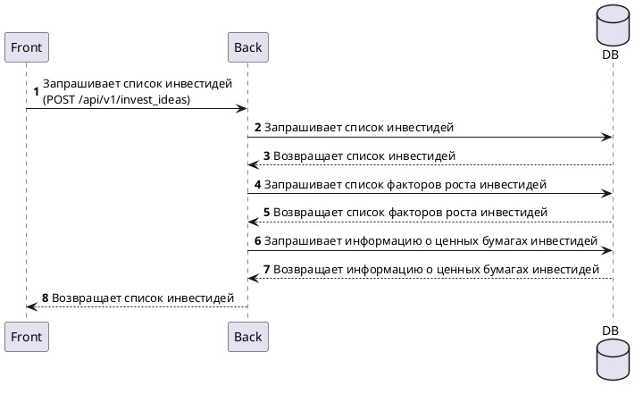

# Получение списка инвестидей

## Описание 

Метод [предоставляет](../../api/invest_idea_service.yaml) список инвестидей для отображения

<!-- - тип: POST
- адрес: /api/v1/invest_ideas
- параметры
    - дата начала периода инвестирования
    - дата завершения периода инвестирования -->

## Cхема работы

## Описание метода

- выполняется поиск в базе даннных
    - в таблице [invest_ideas](../../database/tables/invest_ideas.md) выполяется поиск инвестидей, удовлетворяющих следующим критериям:
        - действительные (поле `expiration_date` > текущая дата)
        - период инвестирования, заданный пользователем, включает срок инвестидеи (поле `buy_date` < $.buyDateStart и поле `sell_date` < $.sellDateEnd)
    - в таблице [securities](../../database/tables/securities.md) выполняется поиск ценных бумаг, соответствующих выбранным инвестидеям
    - в таблице [growth_fators](../../database/tables/growth_factors.md) выполняется поиск факторов роста, соответствующих выбранным инвестидеям
- по полученным данным формируется ответ

## Ограничения

- доступ к методу должны иметь только пользователи с [правом просмотра инвестидей](../rights/invest_idea_view.md)
- если пользователь не указал период инвестирования, то значения полей, передаваемых в фильтре берутся по умолчанию:
    - buyDateStart = максимальная возможная дата
    - sellDateEnd = минимальнрая возможная дата

## Обработка ошибок

### Ошибка связи с БД

- формируется ошибка с кодом 503 "Сервис недоступен"